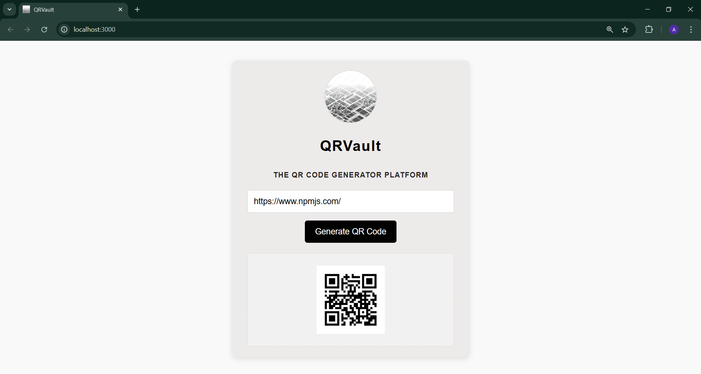

# QRVault

QRVault is a simple and efficient web-based application designed for generating QR codes in real time. It allows users to input a URL or text and instantly display the corresponding QR code, making it easy to share information visually and conveniently.

The application uses Node.js and Express for the backend and provides a responsive, user-friendly interface for seamless QR code generation.


## Features

1. Real-Time QR Code Generation: Generate QR codes instantly from URLs or text.
2. Backend: Built with Node.js and Express for handling API requests and generating QR codes.
3. Frontend: Simple and responsive design using HTML, CSS, and JavaScript.
4. Privacy: No data is stored; QR codes are generated on the fly and not saved.
5. Mobile-Responsive: Optimized for use on desktop, tablet, and mobile devices.
6. Fast & Efficient: Quick response times with no unnecessary database or storage.
.

## Snapshot of QRVault Interface




## Run Locally

Clone the project

```bash
  git clone https://github.com/gupta03akshita/QRVault.git
```

Go to the project directory

```bash
  cd QRVault
```

Install dependencies

```bash
  npm install
```

Start the server

```bash
  node app.js
```

